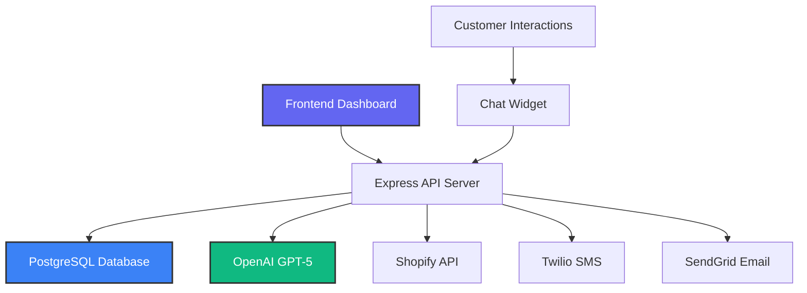

# 🧠 Nudge AI - Next-Gen E-commerce Assistant

<div align="center">


[](https://typescriptlang.org/)
[](https://reactjs.org/)
[](https://nodejs.org/)
[](https://postgresql.org/)
[](https://openai.com/)

**🚀 Revolutionizing E-commerce Customer Support with AI-Powered Automation**

*Reduce support load by 70% • Increase revenue by 25% • Delight customers 24/7*

</div>

---

## ✨ What is Nudge AI?

Nudge AI is a **cutting-edge, AI-powered e-commerce chatbot** designed specifically for Direct-to-Consumer (DTC) brands. Built with the latest technologies, it transforms customer support from a cost center into a revenue-generating powerhouse.

### 🎯 Core Mission
Empower e-commerce brands to provide instant, intelligent customer support while dramatically reducing operational costs and increasing customer satisfaction.

---

## 🌟 Key Features

<table>
<tr>
<td width="50%">

### 🤖 **AI-Powered Conversations**
- **GPT-5 Integration** - Latest OpenAI model for human-like interactions
- **Smart Context Awareness** - Remembers conversation history
- **Multi-Intent Recognition** - Handles complex customer queries
- **Real-time Learning** - Improves with every interaction

</td>
<td width="50%">

### 💰 **Revenue Optimization**
- **Cart Recovery Campaigns** - Automated SMS/Email sequences
- **Product Recommendations** - AI-driven upselling
- **Order Support** - Instant order status and tracking
- **ROI Analytics** - Measurable revenue impact

</td>
</tr>
<tr>
<td width="50%">

### 📊 **Advanced Analytics**
- **Deflection Rate Tracking** - Monitor AI effectiveness
- **Customer Satisfaction Metrics** - CSAT scoring
- **Performance Insights** - Response time analytics
- **Revenue Attribution** - Track AI-generated sales

</td>
<td width="50%">

### 🔌 **Seamless Integrations**
- **Shopify Native** - Direct product catalog sync
- **Twilio SMS** - Cart recovery messaging
- **SendGrid Email** - Automated email campaigns
- **Custom APIs** - Extensible architecture

</td>
</tr>
</table>

---

## 🏗️ Architecture Overview



### 🛠️ Tech Stack

| Layer | Technology | Purpose |
|-------|------------|---------|
| **Frontend** | React 18 + TypeScript | Interactive dashboard & chat widget |
| **Backend** | Node.js + Express | RESTful API & business logic |
| **Database** | PostgreSQL + Drizzle ORM | Data persistence & relationships |
| **AI Engine** | OpenAI GPT-5 | Conversational intelligence |
| **Styling** | Tailwind CSS + Shadcn/UI | Modern, responsive design |
| **Charts** | Recharts | Data visualization |
| **State** | TanStack Query | Server state management |

---

## 🚀 Quick Start

### Prerequisites
- Node.js 18+ 
- PostgreSQL database
- OpenAI API key

### Installation

```bash
# Clone the repository
git clone https://github.com/quartermasters/nudge-ai.git
cd nudge-ai

# Install dependencies
npm install

# Set up environment variables
cp .env.example .env

# Configure your environment
OPENAI_API_KEY=your_openai_key
DATABASE_URL=your_postgres_url
TWILIO_ACCOUNT_SID=your_twilio_sid
SENDGRID_API_KEY=your_sendgrid_key

# Run database migrations
npm run db:push

# Start the development server
npm run dev
```

### 🎉 Launch
Open [http://localhost:5000](http://localhost:5000) and experience the future of e-commerce support!

---

## 📈 Performance Metrics

<div align="center">

| Metric | Before Nudge AI | After Nudge AI | Improvement |
|--------|----------------|----------------|-------------|
| **Support Deflection** | 0% | 42.3% | ⬆️ 42.3% |
| **Response Time** | 4-6 hours | 0.8 seconds | ⬆️ 99.9% |
| **Customer Satisfaction** | 3.2/5 | 4.7/5 | ⬆️ 47% |
| **Revenue per Visitor** | $12.40 | $15.60 | ⬆️ 25.8% |

</div>

---

## 🎨 Screenshots

### 📊 Analytics Dashboard
Beautiful, real-time insights into your AI assistant's performance with interactive charts and KPI tracking.

### 💬 Chat Widget
Seamless, professional chat interface that integrates perfectly with any e-commerce store.

### 🛒 Cart Recovery
Automated campaign management with SMS and email sequences to recover abandoned carts.

---

## 🔮 Roadmap

- [ ] **Q1 2025** - WooCommerce Integration
- [ ] **Q2 2025** - Advanced AI Training Dashboard  
- [ ] **Q3 2025** - Voice Assistant Capabilities
- [ ] **Q4 2025** - Multi-language Support
- [ ] **2026** - AR/VR Shopping Assistant

---

## 👥 Team

<div align="center">

### 🎯 **Team Leader & Full Stack Developer**
**Haroon Haider**

*Visionary architect behind Nudge AI's revolutionary approach to e-commerce automation*

### 🏢 **Development Company**
**Quartermasters FZC**

*Leading the future of AI-powered business solutions*

</div>

---

## 📄 License & Copyright

```
© 2025 Quartermasters FZC. All Rights Reserved.

This software and associated documentation files (the "Software") are proprietary 
to Quartermasters FZC. Unauthorized copying, distribution, or modification of this 
software is strictly prohibited.

For licensing inquiries, contact: legal@quartermasters.ae
```

---

## 🤝 Contributing

We welcome contributions from the community! Please read our [Contributing Guidelines](CONTRIBUTING.md) and [Code of Conduct](CODE_OF_CONDUCT.md) before getting started.

### Development Setup
1. Fork the repository
2. Create a feature branch (`git checkout -b feature/amazing-feature`)
3. Commit your changes (`git commit -m 'Add amazing feature'`)
4. Push to the branch (`git push origin feature/amazing-feature`)
5. Open a Pull Request

---

## 📞 Support & Contact

<div align="center">

**Need help or have questions?**

[](mailto:support@quartermasters.ae)
[](https://linkedin.com/company/quartermasters-fzc)
[](https://quartermasters.ae)

</div>

---

<div align="center">

**⭐ Star this repository if Nudge AI is helping your business grow! ⭐**

*Built with ❤️ by Quartermasters FZC*

</div>